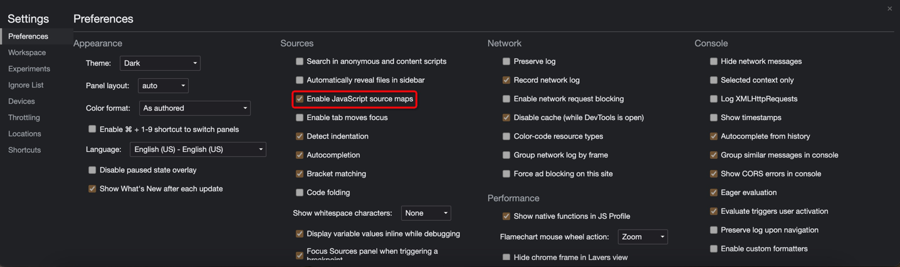
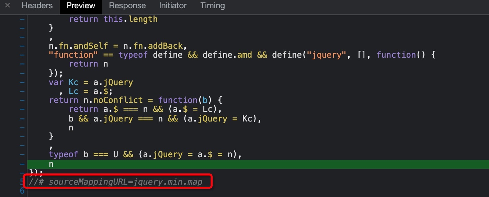
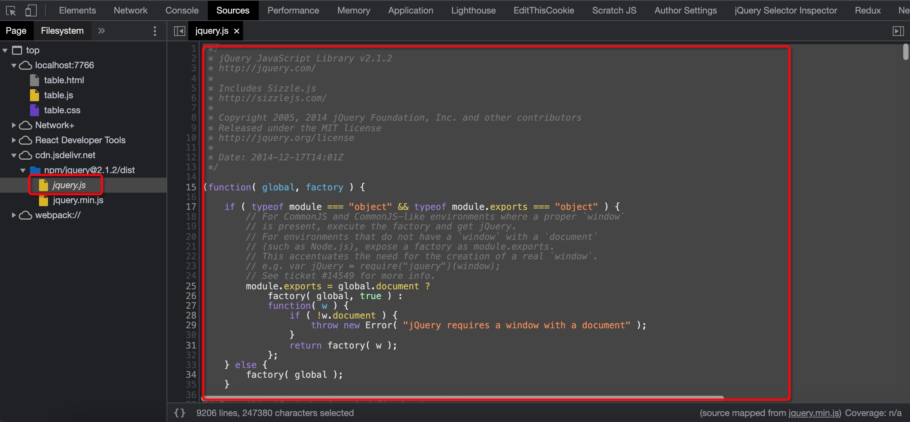
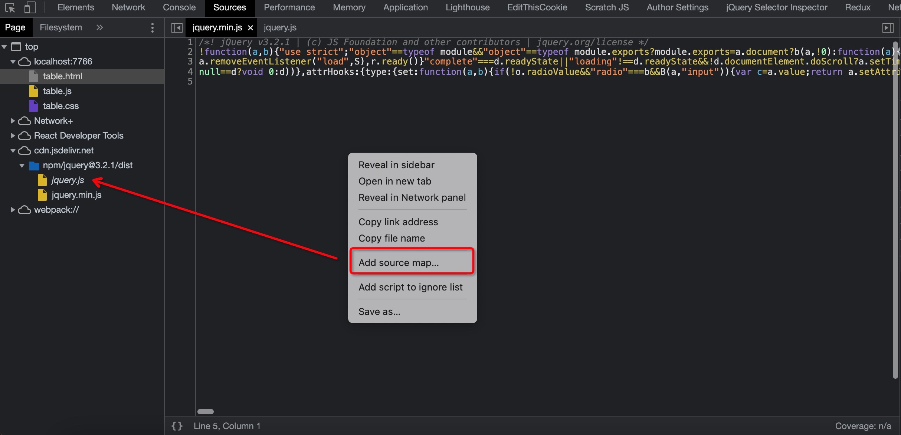

# sourcemap

> sourcemap是为了解决开发代码与实际运行代码不一致时帮助我们debug到原始开发代码的技术,简单说，Source map就是一个信息文件，里面储存着位置信息。也就是说，转换后的代码的每一个位置，所对应的转换前的位置。有了它，出错的时候，除错工具将直接显示原始代码，而不是转换后的代码。这无疑给开发者带来了很大方便。主要讲了一些sourcemap的用法，原理具体可看阮一峰的[JavaScript Source Map 详解](http://www.ruanyifeng.com/blog/2013/01/javascript_source_map.html)

#### 启用 JavaScript source maps

以 https://cdn.jsdelivr.net/npm/jquery@2.1.2/dist/jquery.min.js 为例
压缩后的代码底部有`//# sourceMappingURL=jquery.min.map`,这就是Source Map,它是一个独立的map文件，与源码在同一个目录下,当我们加载jQuery这个资源的时候 `jquery.min.map`也将会被加载

我们查看source --> page的时候发现我们不只加载了jquery.min.js 还加载了 jquery.js ，而jQuery.js 就是我们加载jquery.js.map 转换的源码

#### 如果你只有sourcemap文件，那么可以通过[reverse-sourcemap](https://www.npmjs.com/package/reverse-sourcemap) 获取源码

#### 如何调试线上代码

本地搭建个web服务然后在source面板里面找到压缩后的代码，添加sourcemap 选择你的sourcemap路径这时候你控制台里面的报错信息直接就会定位到你源码的位置

当然你也可以用local overrides复写你的本地代码，这样就会加载你的本地代码来调试线上代码，当然也可以用代理工具等

